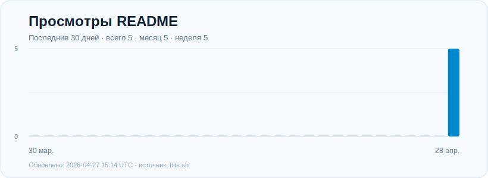

# Какой-то VPN: бесплатный TeleMT proxy

Привет, народ.

Держите публичный TeleMT proxy для Telegram. Это не обычный MTProxy, а TeleMT с TLS-маскировкой, который помогает Telegram работать стабильнее.

Пользуйтесь, делитесь с друзьями и радуйтесь жизни: Telegram снова может работать без VPN.

## Подключить в один клик

[Открыть Telegram proxy](https://t.me/proxy?server=mtproxy.kakoitovpn.ru&port=8448&secret=ee2ad117965b9379e2d30f33d659fab530766b2e636f6d)

Если ссылка не открылась автоматически, скопируйте ее целиком:

```text
https://t.me/proxy?server=mtproxy.kakoitovpn.ru&port=8448&secret=ee2ad117965b9379e2d30f33d659fab530766b2e636f6d
```

## Ввести вручную

В настройках Telegram откройте раздел прокси и добавьте MTProto/TeleMT proxy:

```text
Сервер: mtproxy.kakoitovpn.ru
Порт: 8448
Секрет: ee2ad117965b9379e2d30f33d659fab530766b2e636f6d
```

Готово. Живите спокойно, общайтесь свободно, пусть Telegram просто работает.

## Счетчик


